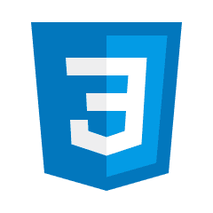
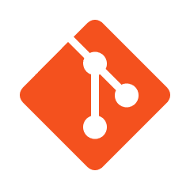

  

  
  
  

  

<a href="https://twers1.github.io">My portfolio website</a>

<h1 align="center">
  Hello, I am Sima Tarverdyan 👋
</h1>

## 📝About Me 
- I'm 18yo, i am a student of information systems and programming and I'm into sports, also video games
- I love to learn new things and conquer programming
- At the moment, I make telegram bots, websites-application, learning gameDev, devOps and backend
## :hammer_and_wrench: My Stack
-  Language : 

 

 

 

- Tools:

 

 

 

- Frontend

 

 

 

- Backend

 

 

 

- DevOps

 yet not started

 

- GameDev

 

 

 

## 🖥️ My Studies
(September 2021 -> currently)- 2nd year in the specialty "Information Systems and Programming" in Moscow college 26KADR

(October 2021 -> November 2022) - Learning Python in college

(March 2022 -> June 2022) - Made a website for my college

(May 2022 -> currently) - [Stepik](https://stepik.org/users/491146538) (courses: JS, WEB-develop, SQL)

(October 2022 -> currently) - I'm making a telegram bot for the Armenian Home store(shop) and for myself

(December 2022 -> December 2022) - Studied pug and gulp, made my own assembly

(January 2023 -> currently) - Learning C#, Java, Unity in college 

## 🔥 My stats

## 🖊️ Reach me

